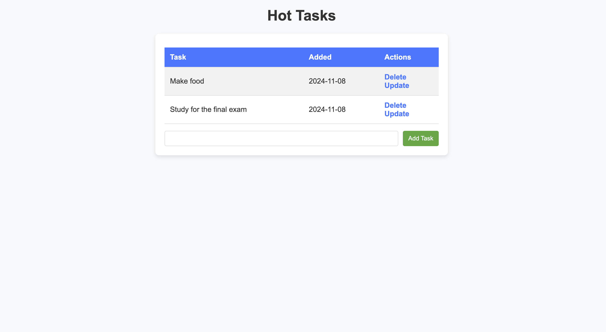
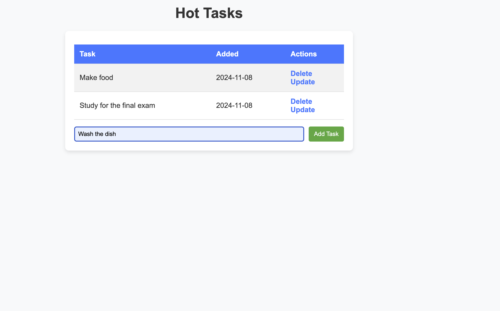
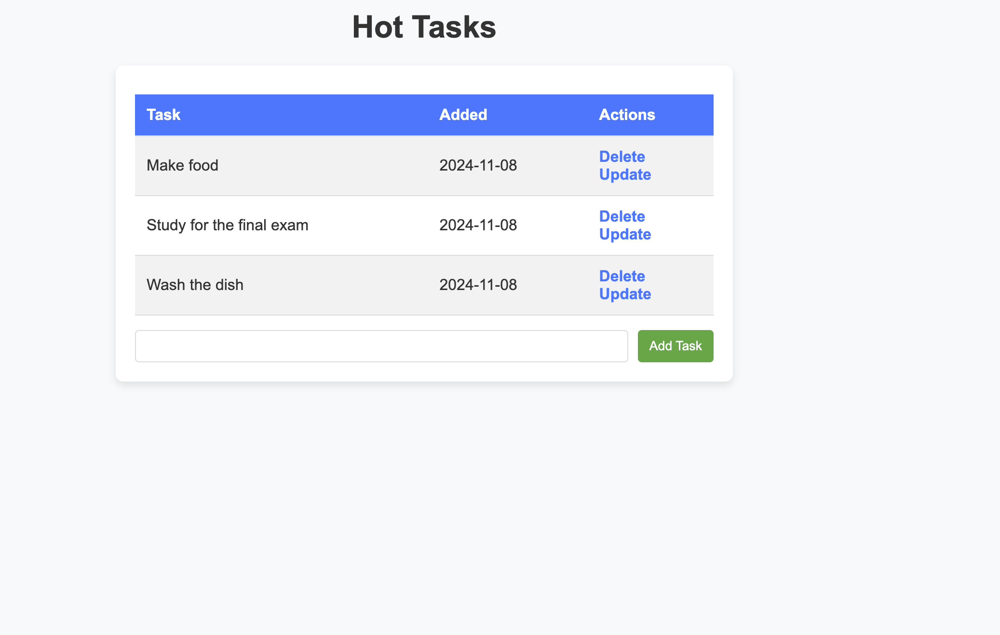
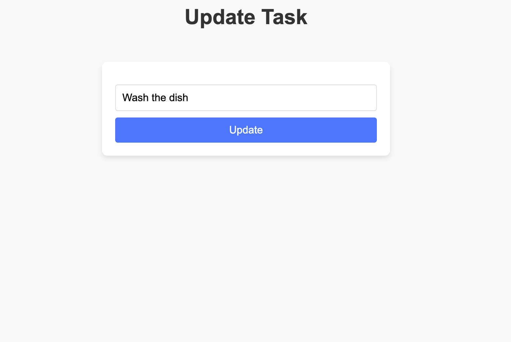

# To-Do Application

This is a simple to-do list application built using Flask. The purpose of this project is to demonstrate how a Flask-based web application works, including basic CRUD (Create, Read, Update, Delete) operations. This app allows users to add, delete, and update tasks in their to-do list.

## Table of Contents

- [Features](#features)
- [Installation](#installation)
- [Usage](#usage)
- [Screenshots](#screenshots)
- [Technologies Used](#technologies-used)

## Features

- **Add Task**: Add a new task to the to-do list.
- **Delete Task**: Remove a task from the list.
- **Update Task**: Modify an existing task.
- **View Task List**: See a list of all tasks.

## Installation

```bash
# Clone the repository
$ git clone https://github.com/amgaina/To_Do_App.git
$ cd to_do_flask

# Create a virtual environment
$ python3 -m venv venv
$ source venv/bin/activate  # On Windows use `venv\Scripts\activate`

# Install dependencies
$ pip install -r requirements.txt

# Run the application
$ flask run
```

## Usage
1. Add a Task: Type the task name in the input field and click the "Add Task" button to add it to your to-do list.
2. Delete a Task: To delete a task, click the "Delete" button next to the task you want to remove.
3. Update a Task: To edit a task, click the "Edit" button next to the task, update the text, and save the changes.

## Screenshots
**Tasks Page**

**Adding Task**

**Task Added**

**Task Update**


## Technologies Used
- **Python**: The primary programming language for building the application.
- **Flask**: A lightweight Python web framework used to build the web application and handle routing.
- **HTML**: Markup language used to structure the web pages.
- **CSS**: Stylesheet language used for styling the web pages and making the app visually appealing.
- **SQLite**: A lightweight database used to store tasks persistently.


